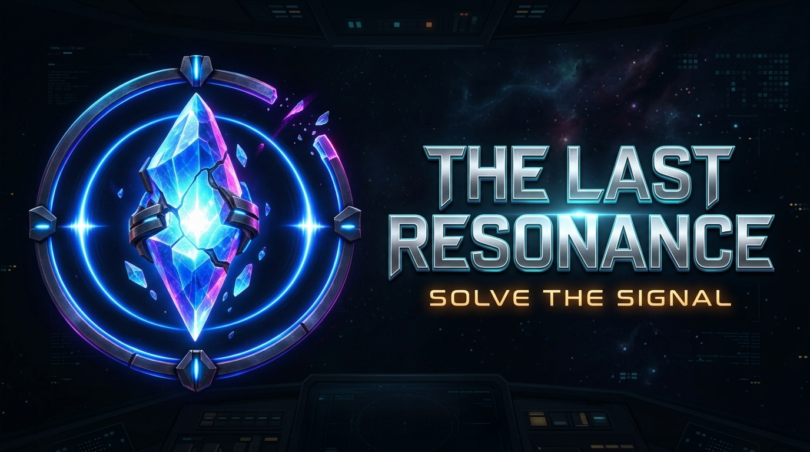

# The Last Resonance

**Trạng thái (2026-09-08):** campaign đã có **15 level**, 4 chương và 3 nhánh kết
thúc. Gameplay, hội thoại, Memory Codex, HUD icon SVG, hologram EVA 3D, save/unlock,
gợi ý offline, chấm sao và visual desktop đã được triển khai. Solver xác nhận 15/15
level đúng par tối ưu; APK debug đã qua preflight. Chưa có benchmark FPS, nhiệt, RAM
hoặc cảm giác chạm trên thiết bị Android thật.

Game giải đố Sokoban 3D/isometric phong cách sci-fi, xây dựng bằng **Godot 4.7** và
**GDScript**. Người chơi điều khiển robot Kiro đẩy các Lumina Core trong trạm Asteria,
khám phá các lớp ký ức và quyết định số phận thành phố.



Tài liệu chi tiết: [docs/README.md](docs/README.md).

---

## Trải nghiệm & điều khiển cảm ứng (Mobile / Android)

Trò chơi hỗ trợ thao tác chạm và vuốt trên Android:

- **Chạm vào ô (Tap-to-Move):** chạm ô hợp lệ để Kiro đi hoặc đẩy Core.
- **Vuốt ngắn:** thực hiện một bước theo hướng camera.
- **Kéo giữ:** xoay góc nhìn yaw; trên PC dùng `Q`/`E` để xoay camera 90°.
- **Hoàn tác (`undo.svg`):** lùi lại một nước đi.
- **Chơi lại (`restart.svg`):** đặt level về trạng thái ban đầu.
- **Xoay cầu (`bridge.svg`):** kích hoạt cầu khi đứng cạnh console tương ứng.
- **Gợi ý:** hiển thị theo 3 cấp bằng `hint_route`; không tăng số bước thật/par nhưng
  hành động được tiết lộ sẽ cộng phí vào điểm tính sao.
- **Tạm dừng (`pause.svg`):** mở tùy chọn âm thanh, accessibility hoặc về menu.

Khi puzzle lệch khỏi đường gợi ý, HUD chỉ hướng phục hồi hoặc đề nghị Undo. Trên
Godot Editor/PC: `WASD` di chuyển, `Z` undo, `R` restart, `H` gợi ý.

---

## Chiến dịch hiện tại

| Chương | Level | Khu vực | Trọng tâm | Par |
| --- | ---: | --- | --- | --- |
| I — Archive | 1–4 | Forgotten Archive | Đẩy Core, thứ tự, cửa | 12 · 28 · 34 · 53 |
| II — Foundry | 5–8 | Mechanical Foundry | Cửa, cầu xoay, puzzle tổng hợp | 57 · 73 · 75 · 87 |
| III — Sanctuary | 9–12 | Flooded Sanctuary | Portal, Elevator, nhiều tầng | 46 · 42 · 61 · 85 |
| IV — Core | 13–15 | Central Core | Energy Node, phối hợp, phán quyết | 40 · 28 · 81 |

Level 11, 12 và 14 dùng hai tầng với Elevator một chiều: phải hoàn thành tầng hiện
tại trước khi lên tầng tiếp theo. Core không đi qua Elevator; Undo hoàn tác trọn thao
tác chuyển tầng.

---

## Cấu trúc hệ thống & tính năng

### 1. Gameplay & Core Logic

- `src/core/game_logic.gd`: engine Sokoban deterministic; Undo/Restart; Core,
  Pedestal, Plate/Door, cầu xoay, Portal, Elevator, Energy Node và điều kiện thắng.
- `src/core/game_state.gd`: autoload lưu unlock, thành tích, ký ức, âm lượng,
  haptics, reduced motion và high contrast.
- `src/core/progress_store.gd`: đọc/ghi save có kiểm tra dữ liệu, backup và migration
  từ định dạng cũ.
- `src/core/score_rules.gd`: ngưỡng 1–3 sao, `score_moves`, `hint_penalty` và cờ
  perfect cho từng level.
- `src/data/levels.gd` và `src/data/level_data.gd`: catalogue/schema level; dữ liệu
  map nằm trong các Resource `.tres`.

### 2. Giao diện (UI / UX)

- `scenes/ui/start_menu.tscn`: menu chính, Continue, chọn level, Memory Codex,
  Settings và thoát.
- `scenes/ui/menu.tscn`: level select theo chương, par, sao và kỷ lục.
- `src/view/game_hud.gd`: bước đi, Core/Plate/Door, tầng, Undo, Restart, Bridge,
  Hint, Pause và modal chiến thắng.
- `scenes/ui/dialogue_box.tscn`: hội thoại Kiro, EVA, Dr. Elias với typewriter,
  avatar, bleep và glitch.
- `scenes/ui/memory_codex.tscn`: đọc lại 15 mảnh ký ức theo chương.
- `scenes/game/ending_cutscene.tscn`: ba ending `PRESERVE`, `RELEASE`, `RESTORE`.

### 3. Đồ họa 3D, nhân vật, hiệu ứng & âm thanh

- Kiro-K7: `assets/models/animations/Kiro_K7/Kiro_K7_Animation_Library.glb`.
- EVA: `assets/models/characters/EVA_v5.glb` và
  `assets/shaders/hologram_eva.gdshader`.
- Dr. Elias Vale: `assets/models/characters/Dr-Elias-Vale_v3.glb`.
- Board 3D, camera, multi-floor framing và decoration: `src/view/board_view.gd`,
  `src/view/camera_controller.gd`.
- Hiệu ứng gameplay: `src/view/vfx_manager.gd`; ambience, SFX, Elevator và Portal:
  `src/view/audio_manager.gd`.
- Material/render theo chương và mobile quality: `src/data/chapter_material_profiles.gd`
  và `src/data/render_quality.gd`.

### 4. Công cụ biên tập & kiểm thử

- `scenes/editor/gridmap_level_editor.tscn`: thiết kế level trong Godot Editor.
- `tests/verify.gd`: replay route, schema, par, save, score, Undo/Restart và
  progression của toàn campaign.
- Các scene `tests/verify_*.tscn`: interaction, multi-floor, audio, material,
  decoration, modular runtime, narrative và mobile render budget.
- `tools/`: validator/baker Python và script dựng asset; `src/tools/` là công cụ
  chạy bên trong Godot Editor.

---

## Sơ đồ cây thư mục

```text
The Last Resonance/
├── assets/                    # Model, texture, shader, icon, font, audio và VFX
│   ├── audio/                 # Nhạc nền, ambience, SFX, voice
│   ├── fonts/                 # Font giao diện
│   ├── icons/                 # Icon ứng dụng/Android
│   ├── materials/             # Material dùng lại
│   ├── models/                # Nhân vật, environment, props, modular kit
│   ├── shaders/               # Hologram và shader môi trường
│   ├── textures/              # Texture đồ họa
│   ├── ui/                    # Logo, background, portrait, HUD art
│   └── vfx/                   # Asset hiệu ứng hình ảnh
├── resources/                 # Dữ liệu Resource tách khỏi code/scene
│   ├── levels/                # Nguồn chuẩn map, entity, par, hint_route
│   ├── mesh_libraries/        # MeshLibrary cho GridMap
│   └── visuals/               # Profile hình ảnh theo chương
├── scenes/                    # Scene Godot chạy trong editor/runtime
│   ├── editor/                # Level editor, gallery, cluster/showcase
│   ├── game/                  # Gameplay chính và ending
│   └── ui/                    # Menu, HUD, dialogue, codex, settings
├── src/                       # Mã GDScript
│   ├── core/                  # Luật puzzle, save/progress, score
│   ├── data/                  # Schema level, story, props, material, render
│   ├── game/                  # Flow màn, input, hint, story
│   ├── tools/                 # Tool chạy trong Godot Editor
│   ├── ui/                    # Controller cho giao diện
│   └── view/                  # Board, camera, HUD, audio, VFX
├── tests/                     # Regression, smoke test runtime, capture QA
├── tools/                     # Validator/baker và công cụ thiết kế level
├── docs/                      # Tài liệu hiện hành và archive các pass cũ
├── project.godot              # Cấu hình dự án, input map, autoload
└── export_presets.cfg         # Preset export Android
```

`resources/levels/level_XX.tres` là nguồn chuẩn của gameplay. `.godot/`, `build/`
và `.codex_qa/` là cache/output/artifact sinh tự động, không phải nơi sửa logic game.

---

## Xuất bản Android

Yêu cầu Python 3 và Godot 4.7.x có trong `PATH` dưới tên `godot` (`godot.exe` trên
Windows cũng được PowerShell nhận).

1. Cấu hình Android SDK/JDK trong Godot Editor.
2. Chọn `Project → Export → Android` với preset `Android`.
3. APK xuất tại `build/TheLastResonance-debug.apk`.

```powershell
godot --headless --path . --export-debug Android build/TheLastResonance-debug.apk
python tools/validate_android_export.py
```

Preflight kiểm tra preset arm64, PCK, manifest, zip integrity, chữ ký và loại trừ
thư mục development khỏi APK. Đây không thay thế playtest trên thiết bị Android thật.

---

## Kiểm tra nhanh

```powershell
python tools/validate_levels.py
godot --headless --path . -s tests/verify.gd
godot --headless --path . tests/verify_interactions.tscn
python tools/validate_map_decorations.py
python tools/audit_assets.py
```

Kết quả kiểm thử và hướng dẫn đầy đủ: [docs/README.md](docs/README.md).
