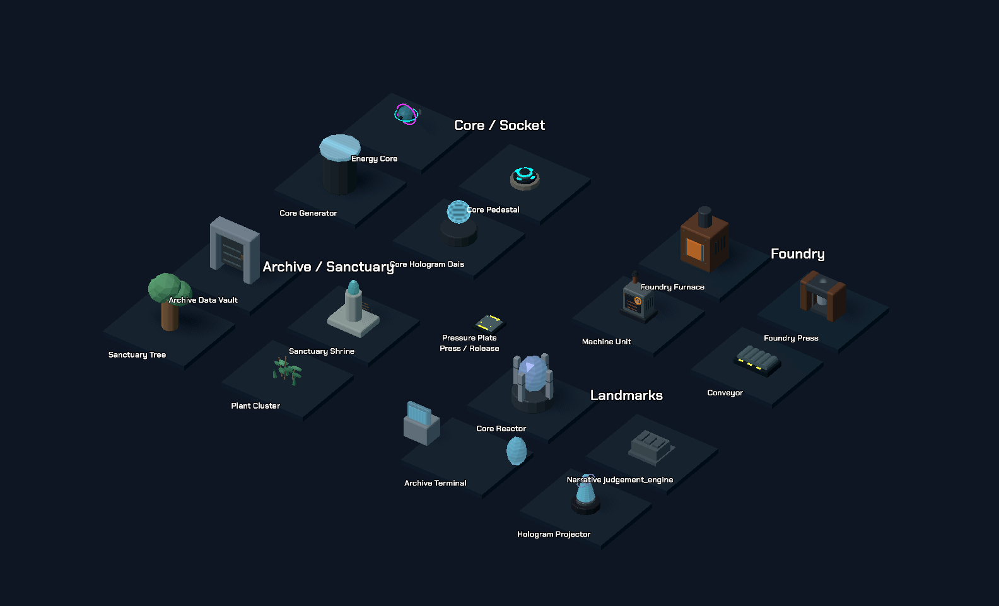

# Hoàn thiện asset

Áp dụng 2026-10-02 trên kiến trúc functional refactor. Nâng cấp trực tiếp 9 GLB: Energy-Core, Core-Pedestal, Foundry-Furnace, Foundry-Press, Machine-Unit, Archive-Data-Vault, Sanctuary-Shrine, Core-Reactor và Narrative-judgement_engine.



Model có bevel, chi tiết cơ khí/socket/contact/vent/inlay và vật liệu kim loại/đá/cao su khác nhau. Details tĩnh được gom theo parent để giảm số mesh; chi tiết piston giữ parent di động. Model lớn nhất 1.456 tam giác. Footprint giữ trong envelope cũ với tolerance 0.002 ô; pivot, gameplay và layout không đổi.

Core dùng crystal teal và emission thấp hơn; VFX orb nhỏ hơn và ít sáng hơn để thấy lõi. Pedestal giữ vòng mục tiêu và giảm emission của model. Node và trạng thái gameplay hiện hữu không đổi.

BoardDecorations tạo ba variation xác định theo vị trí cho cây/plant/debris/rubble/panel hỏng. Bốn GLB biển sector I–IV được gắn tối đa một biển mỗi tầng lên tường hiện hữu. Không thêm ô chặn, đèn hoặc cơ chế gameplay. MeshLibrary giữ 91 item và ID cũ.

18 clip Blender đã bake lại từ geometry nâng cấp. Nguồn chỉnh sửa trong `art/asset_polish/`; nguồn animation trong `art/animated_modules/`. Gallery Godot: `scenes/editor/asset_polish_showcase.tscn`.

```powershell
blender --background --python tools/polish_map_assets.py -- 'D:/GodotProjects/The Last Resonance'
blender --background --python tools/build_module_animations.py -- 'D:/GodotProjects/The Last Resonance'
godot --headless --path . --editor --import
godot --headless --path . -s tools/install_chapter_props.gd
godot --headless --path . -s tools/build_animated_module_showcase.gd -- --polish-gallery
```

Kiểm tra: 13 nhóm regression liên quan đạt; footprint/triangle/sign count/variation được kiểm riêng. Renderer Vulkan capture studio và 18 góc campaign không báo lỗi. Android thật chưa benchmark; không khẳng định FPS/RAM thiết bị.
