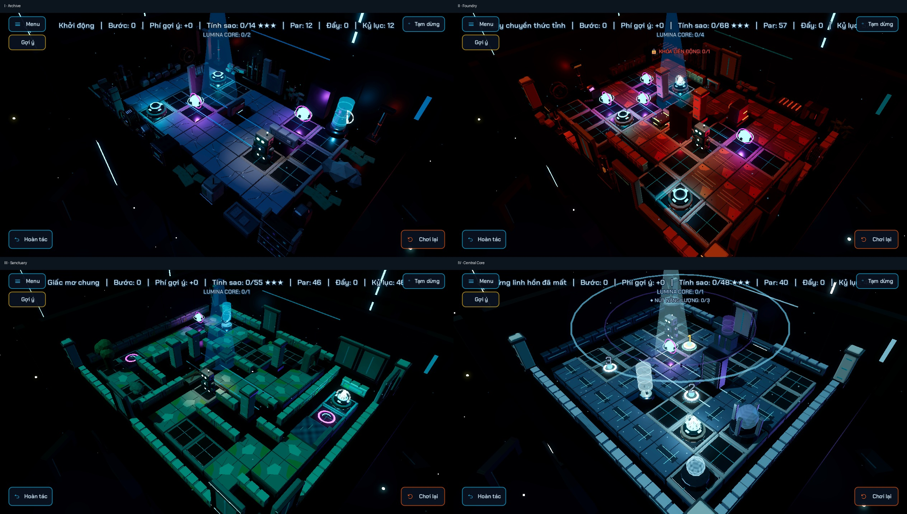

# Sàn và tường theo chương — campaign

Áp dụng 2026-10-02 vào cả 15 level và 18 tầng chơi: 293 cell sàn dùng panel mới, 343 cell dùng tường thấp mới (gồm một tường L1 thay mảnh cũ). Puzzle fields đối chiếu với HEAD không thay đổi: map/maps, entities, hint_route, par, chapter và mục tiêu giữ nguyên.



## Phối kiến trúc

- Archive: dải panel nứt và nẹp sửa theo vùng, xen sàn cũ để giữ tín hiệu ô và bệ rõ.
- Foundry: các làn sàn rỉ/gân chống trượt; hướng panel theo trục dài của phòng và dây chuyền.
- Sanctuary: cụm đá ẩm/rêu quanh nước và mép đường, tường thấp giữ khung vòm/cột góc/landmark nổi bật.
- Central Core: panel dẫn sáng theo các hàng/cột có trật tự; emission thấp hơn Energy Node và mục tiêu.
- Chừa cell chứa Core ban đầu, bệ, plate, door, portal, elevator, bridge, spawn và các entity/decor overlay khác. Sàn mới không che các dấu hiệu tương tác.
- Tường mới chỉ trên `#` cạnh sàn chơi; props và cột góc hiện hữu giữ lại. Low wall giúp giảm che khuất so với các wall/pillar cao mặc định.

## Floor skin

`assets/models/map_surfaces/*_floor_variant.glb` là bốn skin hoàn chỉnh dùng nội bộ cho campaign. Mỗi skin gộp foundation StoneSlab hiện có với panel mới, một mesh và tối đa bốn material surface. Mặt panel nằm tại 0.128 game-unit tính từ pivot, gần mặt inset cũ 0.1275; detail nổi cao tối đa 0.142, thấp hơn bolt cao nhất của tile cũ 0.15375.

Decoration có `surface_skin = true` khiến BoardView bỏ base Floor-Tile tại cell đó và đặt skin ở `world_position(cell)`. Vì thế không vẽ hai tile chồng nhau, không đổi khoảng cách tầng 1.15, và số mesh giảm so với tám bộ phận của tile cũ. Variant overlay gốc trong `map_expansion/` vẫn dùng được độc lập trong editor/gallery.

Palette được bake theo chương, không áp weathering chương lần thứ hai. Floor skin và wall variant giữ emission gốc nhẹ; chúng không được đẩy tới mức glow gameplay khi restore power.

## Authoring và tạo lại

Các decoration của pass có `surface_pass = "chapter_surface"`. Tool chỉ tạo lại phần nó sở hữu, giữ các props khác; tường L1 có `replaces_type` để dựng lại idempotent. Dữ liệu theo level/tầng và hash puzzle nằm trong `CAMPAIGN_SURFACES.json`.

```powershell
& 'C:/Program Files/Blender Foundation/Blender 5.2/blender.exe' --background --python tools/build_campaign_floor_skins.py -- 'D:/GodotProjects/The Last Resonance'
python tools/apply_campaign_surfaces.py
godot --headless --path . --editor --import
python tools/validate_map_decorations.py
python tools/run_tests.py -t verify_campaign_surfaces verify_campaign_dressing verify_module_motion verify_environment_dynamics verify_mobile_render_budget verify_modular_runtime verify_map_expansion verify_interactions verify_multifloor_camera verify_sequential_elevator_runtime verify
godot --path . --resolution 1280x720 --windowed tests/campaign_surface_capture.tscn
```

GridMap round-trip cũ không giữ mọi field custom của campaign (`surface_skin`, pass provenance, nhiều tầng); không dùng export GridMap để ghi đè các level hoàn chỉnh. Sửa LevelData trực tiếp hoặc chạy lại authoring tool.

## Nghiệm thu

- 15/15 puzzle snapshots khớp HEAD; chạy tool lần nữa không đổi file.
- Placement: 930 decoration hợp lệ, không đặt floor lên ô chặn hoặc wall lên ô đi được; entity và landmark giữ nguyên.
- 11 nhóm regression đạt, gồm floor envelope/material budget, bỏ tile cũ, cao độ tầng, motion/mobile, cửa/plate/portal/thang, camera và route replay.
- Chụp và review 18 góc gameplay bằng Vulkan Forward Mobile: đầu 15 level và tầng 2 của L11/L12/L14. Ảnh đầy đủ trong `.codex_qa/campaign_surfaces/`.
- Android thật chưa benchmark. Floor skin đã giảm mesh và giữ budget material, nhưng đây không thay cho số đo FPS/RAM trên thiết bị.
