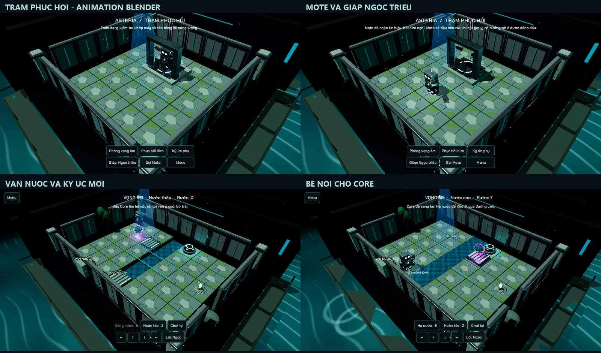

# Blender và Godot: bộ mở rộng vọng âm

Menu chính có **TRẠM PHỤC HỒI** và **PHÒNG VỌNG ÂM**. Trạm cho xem ký ức phụ đã kiếm được, đổi ngoại hình, phục hồi Kiro bằng tay máy và gọi Mote. Không có tiền tệ hoặc chỉ số sức mạnh mới; luật 15 màn chiến dịch giữ nguyên.

| Asset Blender | Tích hợp Godot |
|---|---|
| `tidal_valve` | Tay quay `ValveTurn`, đảo chiều khi nâng/hạ nước |
| `tidal_raft`, `dry_crossing` | Thay geometry tạm; bệ chở Core và đường cạn dùng luật hiện có |
| `mote` | Rig bộ phận, clip `Hover`/`Perch`; theo Kiro, đậu, dẫn tới ô gợi ý, ăn mừng rồi trở lại |
| `kiro_tidal_pack` | Giáp lưng bám bone torso bằng BoneAttachment3D; mở/trang bị theo phần thưởng Ngọc triều |
| `restoration_station` | Clip `Restore`, Kiro vào bệ, tay máy hoạt động, Kiro trở về; audio chương 3 và âm thanh tương tác |
| `memory_echo` | Vật thể ký ức có glyph orbit `Resonate`, nối thu thập và journal/save của bản thử |

GLB: `assets/models/echo_expansion/`. Source chỉnh sửa: `art/echo_expansion/echo_expansion.blend`, bảy collection bố trí riêng trong scene Echo Expansion Studio. Tái tạo bằng Blender background + `tools/build_echo_assets.py -- <project-root>`. Geometry dùng grid authoring 2x, runtime 0.5. Giáp bù scale Kiro 0.28 ở bone attachment. Mesh có bevel nhỏ, vật liệu đá cổ/kim loại oxy hóa/đồng và LED xanh dịu. Mesh tĩnh được gộp theo parent để giảm draw calls; bộ phận động giữ pivot riêng. Native animation được xuất bằng NLA tracks; mesh tĩnh không có clip thừa.

Mote dùng controller companion hiện có, không đổi hệ thống tính phí gợi ý. Mobile không có đèn local Mote. Reduced Motion ngừng cánh/bob và bỏ vòng ăn mừng; animation máy phục hồi/van ngắn vẫn thể hiện tương tác. Trạm không thay tiến độ campaign. Giáp và ký ức dùng save mở rộng đã có; đồ đã mở vẫn giữ qua lần chạy sau.

Kiểm tra asset/clip/triangle budget, bone attachment, đậu/gợi ý/ăn mừng Mote, phục hồi trạm, route trial/undo/save và mobile budget đã PASS. Replay cả 15 màn vẫn PASS. Đã xem render Vulkan của trạm, phục hồi, Mote, trial và bệ nổi. QA dùng cờ không lưu và khôi phục record; chưa benchmark Android thật.

