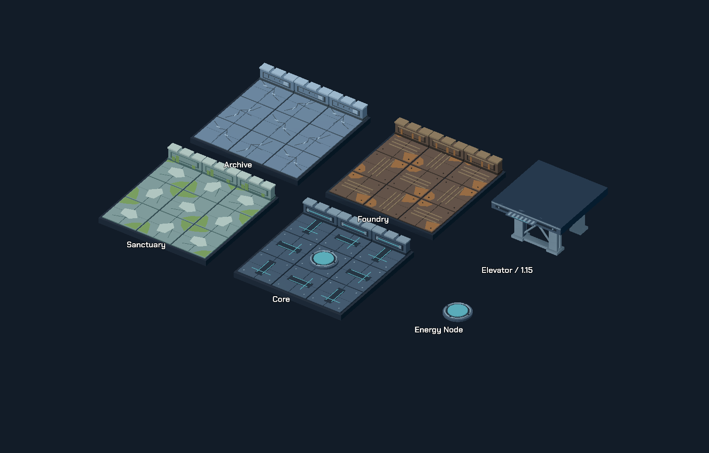

# Kit bổ sung dựng map

13 model mới: 1 Energy Node, 8 biến thể sàn/tường bốn chương, 4 mảnh thang máy. MeshLibrary có 91 item; 12 item mới mang tiền tố `Expansion_`. Energy Node được BoardView gắn theo entity gameplay, không nằm trong danh sách decoration.



## Mở bộ model

- Blender: `art/map_expansion/Map_Expansion_Gallery.blend`. Bốn phòng mẫu và một cụm chân đỡ; file riêng với roster gameplay. Thư mục nguồn có `.gdignore` để Godot không nhập toàn bộ gallery thành model runtime.
- Godot: `scenes/editor/map_expansion_showcase.tscn`, F6 để xem. Các GLB là instance thật, có thể chọn và sao chép.
- GridMap: `scenes/editor/gridmap_level_editor.tscn`, chọn `Expansion_*` trong MeshLibrary.
- GLB: `assets/models/map_expansion/`; kích thước và tam giác từng model nằm trong `MAP_EXPANSION_BOUNDS.json`.

## Danh mục

| `type` | Nội dung | Đặt trên |
| --- | --- | --- |
| `archive_floor_variant` | Panel nứt, đường gãy và nẹp sửa | Sàn đi được |
| `archive_wall_variant` | Tường thấp nứt, tấm vá | Ô `#` |
| `foundry_floor_variant` | Panel rỉ, gân chống trượt, bu-lông | Sàn đi được |
| `foundry_wall_variant` | Tường thấp với vệt rỉ và nẹp bảo trì | Ô `#` |
| `sanctuary_floor_variant` | Đá ẩm, mảng rêu, khe nứt | Sàn đi được |
| `sanctuary_wall_variant` | Tường đá thấp phủ rêu | Ô `#` |
| `core_floor_variant` | Panel và đường dẫn sáng nhẹ | Sàn đi được |
| `core_wall_variant` | Tường thấp, rãnh dẫn sáng | Ô `#` |
| `elevator_support_column` | Cột thép, bản mã trên/dưới | Ô chặn cạnh thang, ở tầng dưới |
| `elevator_support_brace` | Khung giằng chữ X, rộng 1 ô | Ô chặn cạnh thang, ở tầng dưới |
| `elevator_deck_fascia` | Viền che cạnh sàn tầng trên | Biên deck ở tầng trên |
| `elevator_threshold` | Ngưỡng thấp chống trượt | Lối vào thang |

Energy Node có đế 0.72 × 0.72 ô, cao 0.098 ô, lens riêng tên `NodeLens`. BoardView dùng GLB mới cho các Node ở L13–15, đặt trên mặt sàn của đúng tầng; vẫn dùng material năng lượng, vòng sáng, số thứ tự và feedback tiến độ/reset hiện có. Không thêm mechanic.

Pass [module động](MODULE_MOTION.md) thêm shader trạng thái cho lens: Node kế tiếp màu amber, Node đã hoàn thành màu xanh, Node chưa tới tối hơn. Hình học sàn/tường/chân đỡ của kit bổ sung vẫn cố định.

## Quy ước ghép

- Authoring 2×; runtime và MeshLibrary áp dụng `0.5`. Pivot ở tâm ô và mặt sàn. Mỗi model không vượt footprint 1×1 ô.
- Sàn là lớp phủ cao tối đa 0.042 ô, có đáy ở 0, đặt lên sàn hiện hữu. Xoay `yaw` 0/90/180/270 để giảm lặp; nên xen kẽ với sàn thường. Vết nứt, rỉ và rêu được tạo bằng geometry/material, không cần texture ngoài.
- Tường cao 0.36 ô. Chỉ đặt trên `#`; BoardView bỏ visual tường mặc định tại ô có decoration nhưng không đổi luật chặn.
- Cột và giằng cao 1.14 ô cho khoảng cách tầng 1.15 ô của BoardView. Đặt từ mặt sàn tầng dưới; bản mã trên lồng vào deck, dừng thấp hơn mặt sàn tầng kế tiếp 0.01 ô để không trùng mặt. Chừa ô Elevator và tuyến đi bộ/đẩy Core.
- Fascia mặc định ở cạnh Bắc (`-Z`), dài 1 ô, hạ xuống 0.20 ô. Đặt trên tầng trên; xoay 180° để dùng ở cạnh Nam. Đỉnh cap thấp hơn mặt deck 0.006 ô, mặt ngoài nhô khỏi biên deck 0.006 ô để tránh trùng mặt.
- Threshold mặc định ở cạnh Bắc, rộng 0.8 ô, cao 0.025 ô; xoay để đặt ở hướng tiếp cận. Đây là decoration, không tự tạo Elevator.
- GridMap export khóa ô neo của tường/cột/giằng thành `#`; các lớp phủ/viền/ngưỡng giữ sàn đi được. GridMap chỉ có một item mỗi ô; dùng `LevelData.decorations` hoặc Node3D nếu cần chồng nhiều mảnh. Round-trip GridMap nhiều tầng vẫn có giới hạn của công cụ hiện tại.
- Khi viết LevelData trực tiếp, dữ liệu puzzle quyết định ô chặn; model không có collision tự động. Các biến thể giữ palette đã bake, không áp thêm chapter weathering lần thứ hai.

```gdscript
decorations = [
    {"type": "archive_floor_variant", "grid_position": Vector3i(2, 0, 2), "yaw": 90.0},
    {"type": "elevator_support_column", "grid_position": Vector3i(0, 0, 0)},
    {"type": "elevator_deck_fascia", "grid_position": Vector3i(2, 1, 0)}
]
```

Tọa độ trên chỉ minh họa; ô cột phải là ô chặn trong map thực tế.

## Tạo lại và kiểm tra

```powershell
& 'C:/Program Files/Blender Foundation/Blender 5.2/blender.exe' --background --python tools/build_map_expansion.py -- 'D:/GodotProjects/The Last Resonance'
godot --headless --path . --editor --import
godot --headless --path . -s tools/install_chapter_props.gd
godot --headless --path . -s tools/build_map_expansion_showcase.gd
godot --path . --resolution 1600x1050 --windowed scenes/editor/map_expansion_showcase.tscn -- --capture
python tools/run_tests.py -t verify_map_expansion verify_modular_kit verify_modular_runtime verify_chapter_props verify_interactions verify
```

Kiểm tra ngày 2026-10-01: bounds sau GLB import, footprint, chiều cao nối tầng, material/lens, MeshLibrary, bốn hướng GridMap export/import, spawn trên hai tầng và Node trong L13/L14/L15. 13 GLB tổng 2.649 tam giác; model lớn nhất là Energy Node (868). Cảnh mẫu được review qua ảnh render; Android thật chưa benchmark. Ngày 2026-10-02, sàn/tường được áp dụng vào cả 15 màn qua [campaign surface pass](CAMPAIGN_SURFACES.md); các mảnh chân đỡ/viền thang vẫn là tài nguyên sẵn có để authoring.
