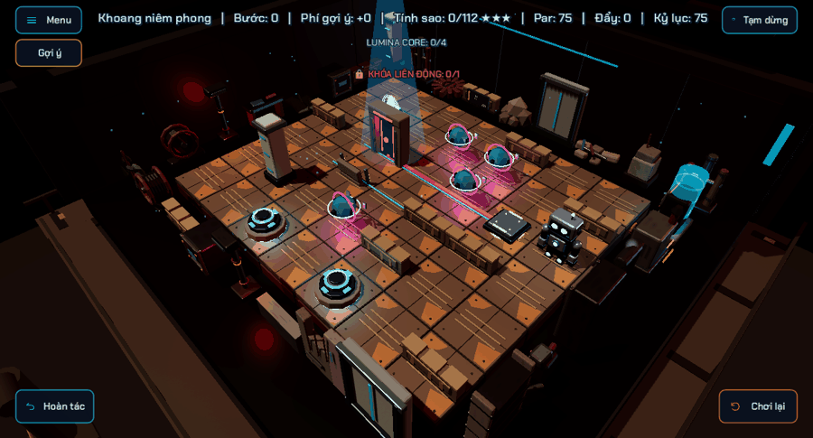

# Map và Kiro phản hồi theo hành động

Giữ animation GLB Idle/Walk/Push/Interact/Victory. `BoardActors` thêm độ nghiêng 2° khi bước và 5° khi đẩy, tự trả về tư thế thẳng; blend clip ngắn và nhịp Push chậm hơn. Không sửa vị trí đích hoặc thời gian luật chơi. Mắt/lõi sáng dịu khi nghỉ và có một nhịp tăng sáng khi bước, đẩy, tương tác hoặc thắng. Tắt nguồn hủy glow đang chạy.

Sau khi robot tới ô mới, VFX tạo bụi nhỏ theo sắc chất liệu thay vì vòng neon ở mỗi bước. Chương 3 chỉ thêm gợn nước bên ngoài bệ khi bước sát biên; không tạo splash ở giữa sàn hay trên tầng cao. Basin có tối đa ba gợn, mobile hai; pause dừng đồng hồ và Reduced Motion ngăn sự kiện.

`BoardGameplayObjects` lưu route ngay khi dựng trace công tắc–hub–cửa. `MapResponse` cho một packet sáng chạy đúng route khi core đặt lên/rời công tắc, xanh khi kích hoạt và hổ phách khi ngắt. Giới hạn ba packet desktop/hai mobile, không thêm light/collision. Packet thuộc layer nguồn và bị dọn khi tầng ẩn. Logic cửa phản hồi ngay như trước.

Khi cấp điện, `BoardLighting` fade đèn theo vị trí với độ trễ tối đa 0.6 giây. Máy trong `ModuleMotion` khởi động theo khoảng cách tới robot, tăng tốc dần và có một burst nếu phù hợp. Burst vẫn dùng budget hiện có. Reset/ngắt nguồn hủy chuỗi pending. Reduced Motion không thêm nghiêng, glow pulse, packet, ripple hoặc delay máy. Âm thanh hơi/tia lửa 3D dùng khoảng suy giảm ngắn hơn để nguồn xa nhỏ hơn; nhạc và ambience theo chương giữ nguyên.

Không thêm camera shake; phản hồi camera ở thao tác đẩy/cửa/mục tiêu dùng cơ chế sẵn có. Các chu kỳ native máy, hơi và tia lửa hiện có được giữ, không nhân đôi hiệu ứng.

Kiểm tra: `verify_map_response`, replay 15 màn, action execution, interactions, authored mechanisms, game coordinator, module motion, mobile budget, lighting readability, sector exterior, scenery clearance và sequential elevator đều PASS. Đã render động bằng Vulkan; preview là trình diễn response trong scene thật, không phải bản ghi giải màn. Profile mobile được kiểm tra cấu trúc, chưa benchmark máy Android.

