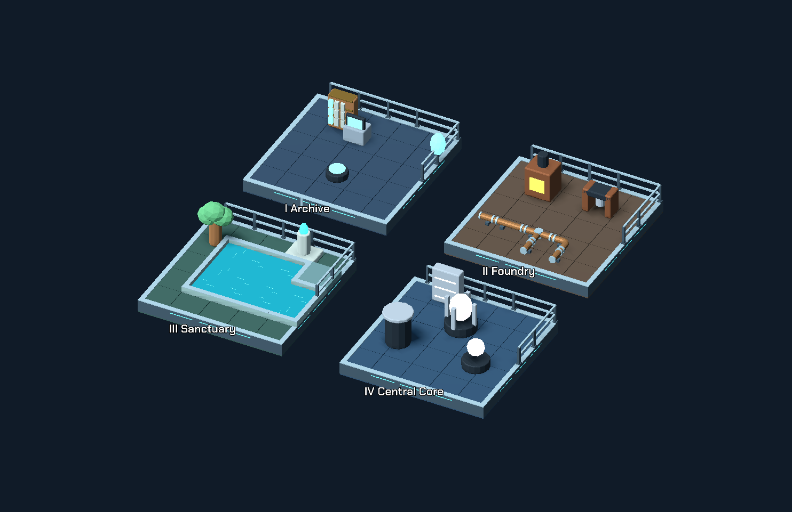

# Bộ mảnh ghép dựng map

**20 loại** (`kit_*`): mép sàn, lan can, tường thấp, ống, nước. Scale GLB 2× → runtime `0.5`. Pivot tâm ô, mặt sàn.

MeshLibrary project: **79** item. Desktop đã xem trong camera gameplay; Android chưa benchmark.



## Mảnh ghép và cách đặt

Tỷ lệ chuẩn: một ô game = 1 đơn vị. File GLB được xuất ở tỷ lệ 2x, runtime/editor áp dụng `0.5`. Gốc tọa độ ở **tâm ô và mặt sàn**, không tự đưa về giữa hình học; điều này giữ đúng mép nối của các mảnh lệch về cạnh ô.

Hướng dùng trong bảng: Bắc = -Z, Đông = +X, Nam = +Z, Tây = -X. Các hướng là trục thế giới, không phải trái/phải màn hình sau khi xoay camera.

| `type` trong LevelData | Công dụng và hướng mặc định |
| --- | --- |
| `kit_floor_edge` | Mép sàn thẳng ở cạnh Bắc; dài 1 ô, mặt bên hạ xuống 0,4 đơn vị |
| `kit_floor_corner` | Góc mép sàn nối Bắc–Đông; dùng bốn góc xoay để bao nền |
| `kit_floor_end` | Tấm bịt đầu Đông của đoạn mép Bắc; ghép cùng ô với mép sàn khi cần kết thúc |
| `kit_rail_straight` | Lan can dọc cạnh Bắc, nối từ Tây sang Đông |
| `kit_rail_corner` | Lan can rẽ từ cạnh Bắc sang cạnh Đông |
| `kit_rail_end` | Đoạn kết thúc: nhận đầu Tây, dừng ở giữa cạnh Bắc |
| `kit_wall_low_straight` | Tường thấp thẳng, cao khoảng 0,37 ô; chỉ thay visual của ô `#` đã bị chặn |
| `kit_wall_low_corner` | Góc tường thấp chữ L; dùng trên ô `#` ở chỗ đổi hướng biên kiến trúc |
| `kit_wall_low_end` | Đầu kết thúc tường thấp; dùng để tránh mảng tường bị cắt cụt |
| `kit_pipe_straight` | Ống nối Tây–Đông |
| `kit_pipe_elbow` | Co ống nối Tây–Nam, đoạn cong liên tục |
| `kit_pipe_tee` | Ống chia nhánh Tây–Đông–Nam |
| `kit_pipe_end` | Đầu ống bịt: nhận đầu Tây, kết thúc gần tâm ô |
| `kit_water_tile` | Mặt nước đầy ô, dùng ở lòng hồ |
| `kit_water_edge` | Bờ thẳng ở Bắc, phần còn lại là nước |
| `kit_water_corner` | Góc bờ lồi Bắc–Đông |
| `kit_water_inner_corner` | Góc bờ lõm ở Đông Bắc, ghép hồ chữ L hoặc chỗ đất nhô vào |

Ống có tâm cao `0.22`, bán kính `0.10`; đầu nối ở biên ô `±0.5`. Lan can có thanh trên cao `0.64`, trục thanh cách tâm ô `0.43`. Dùng đúng các mảnh góc để đổi hướng; xoay mảnh lan can 180° sẽ chuyển nó sang cạnh đối diện của ô.

Để đảo đầu kết thúc mà vẫn giữ cùng cạnh, cần bù offset. Ví dụ `kit_rail_end` xoay 180° và `offset_z = -0.86` sẽ nhận đầu Đông tại cạnh Bắc. Cảnh mẫu có trường hợp này. Không áp dụng offset đó cho ống ở tâm ô.

Kích thước, đầu nối, số tam giác và nguồn tạo từng file: [MODULAR_KIT_BOUNDS.json](MODULAR_KIT_BOUNDS.json). Các mảnh cùng một kit dùng chung bảng màu/material; hiện chưa có bộ vật liệu hư hỏng hoặc rêu phủ riêng cho từng chương.

## Mở và sử dụng

- Mở `scenes/editor/modular_map_showcase.tscn`, nhấn F6 để xem bốn khu mẫu. Scene được lưu với các instance model thật nên có thể chọn, di chuyển và sao chép ngay trong editor.
- Mở `scenes/editor/gridmap_level_editor.tscn`, chọn item `Kit_…` để vẽ các mảnh trên GridMap.
- Khi viết LevelData, dùng `type` ở bảng trên; hỗ trợ `grid_position`, `yaw`, `scale` và các `offset_x/y/z` theo BoardView.
- Để ghép mép sàn và lan can trên cùng một ô, đặt nhiều dictionary trong `decorations`, hoặc dùng các Node3D riêng như cảnh mẫu. GridMap hiện có chỉ giữ một item mỗi ô, nên không thể vẽ chồng hai mảnh trong cùng cell.

Ví dụ một ống thẳng nối sang co rồi đi xuống phía Nam:

```gdscript
decorations = [
    { "type": "kit_pipe_straight", "grid_position": Vector3i(1, 0, 3) },
    { "type": "kit_pipe_elbow", "grid_position": Vector3i(2, 0, 3) },
    { "type": "kit_pipe_straight", "grid_position": Vector3i(2, 0, 4), "yaw": -90.0 }
]
```

Các mảnh có thể được đặt ở tầng cao bằng `grid_position.y`; BoardView tính cao độ theo tầng hiện tại. Bộ sync GridMap cũ chưa hỗ trợ round-trip đầy đủ dữ liệu campaign nhiều tầng: dùng LevelData trực tiếp cho bước hoàn thiện màn nhiều tầng.

Đợt này cũng sửa đường đặt decoration trong BoardView: trước đây đã tính vị trí tầng nhưng khi spawn lại dùng cao độ tầng trệt. Cao độ mới giữ tầng và cộng `offset_y` đúng một lần, áp dụng cho cả props cũ.

## Quan hệ với gameplay

Đây là **hình học trang trí**, không thêm luật di chuyển, va chạm, dòng nước hoặc vận chuyển năng lượng. Các mảnh sàn/lan can/ống/nước không tự tạo wall. Riêng `kit_wall_low_*` chỉ được đặt trên ô `#` đã có trong LevelData: BoardView bỏ visual tường cao mặc định tại ô đó và dùng low-wall thay thế, nhưng `GameLogic.walls` không đổi. Quyết định ô đi được/chặn vẫn hoàn toàn nằm trong dữ liệu puzzle.

Mặt nước là lớp nước nông opaque: đáy ở mặt sàn, nước cao `0.075`, bờ cao `0.22` tính từ pivot. Có thể đặt trên sàn có sẵn mà không bị sàn che. Đây chưa phải vùng nước sâu, shader phản xạ hoặc cơ chế gây hại. Lan can không tự ngăn nhân vật; chỉ đặt ở biên đường đi đã xác định bởi map.

Bốn khu mẫu là cảnh thử ghép tài nguyên, không phải bốn level puzzle mới. A2 đã được đặt thử có kiểm soát ở L2/L6/L11/L14; chỉ thay decoration, không đổi map/entity/route/par.

## Tạo lại và kiểm tra

```powershell
& 'C:/Program Files/Blender Foundation/Blender 5.2/blender.exe' --background --python tools/build_modular_kit.py -- 'D:/GodotProjects/The Last Resonance'
godot --headless --path . --editor --import
godot --headless --path . -s tools/install_chapter_props.gd
godot --headless --path . -s tools/build_modular_showcase.gd
godot --headless --path . -s tests/verify_modular_kit.gd
```

`build_modular_kit.py` tạo lại 20 GLB trong `assets/models/modular/` và báo cáo bounds. `build_modular_showcase.gd` tạo lại scene mẫu: nếu muốn chỉnh bố cục thủ công, lưu bản sao scene với tên khác trước khi chạy lại script.

Đã kiểm tra: bounds model và mesh editor; đủ các bộ phận khi ghép; tiết diện đầu ống thực tế tại mép ô; nối và xoay 90°; 20 loại ở bốn hướng xuất–nhập đúng vị trí/type/yaw; chạy installer lần nữa không đổi ID hoặc thêm item trùng; cảnh mẫu chứa đủ 20 loại. A1/A2 đạt test modular headless và low-wall A2 đã được xem bằng Vulkan `Forward Mobile` trong gameplay camera.

`tests/verify_modular_runtime.tscn` kiểm tra đường spawn thực trong BoardView với 40 instance ở hai tầng, gồm cao độ, offset, scale và yaw; đồng thời khóa việc A2 ở L2/L6/L11/L14 vẫn nằm trên puzzle wall và spawn đúng GLB.

Chưa đo trên Android thật. Campaign đã qua representative + 15-level visual review; bước tiếp theo phù hợp là benchmark/playtest thiết bị thật trước khi tăng triangle, surface, shader detail hoặc mật độ modular.
