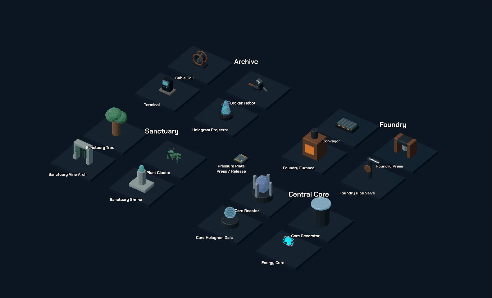

# Module map động

Cập nhật 2026-10-02. Đã áp dụng vào campaign hiện tại qua BoardView, không cần sửa layout LevelData: 79 loại scenery được kiểm kê sau [surface pass](CAMPAIGN_SURFACES.md), 41 loại có chuyển động/hiệu ứng, 38 loại kết cấu hoặc đồ inert giữ cố định. 18 GLB có clip Blender thật; riêng scenery trong campaign có 39 instance dùng clip, ngoài Core, Pedestal, Fragment và bàn áp lực gameplay.



## Mở và xem

- Chơi campaign: cơ cấu máy/điện/cây bắt đầu chạy khi BoardView dựng model. L1–4 có tia lửa và tín hiệu; L5–8 có con lăn/piston/hơi nước; L9–12 có cây/dây leo/nước; L13–15 có reactor/hologram và trạng thái Node.
- Godot: `scenes/editor/animated_module_showcase.tscn`, F6. Gallery chạy hiệu ứng thật và demo bàn áp lực nhấn/nhả.
- Blender: `art/animated_modules/Animated_Module_Gallery.blend`, Space để chạy/dừng. 18 model nguồn nằm trong các collection `ANIM_*`; các file `.blend` riêng ở cùng thư mục có thể chỉnh keyframe trực tiếp.
- GridMap/MeshLibrary vẫn là mesh preview tĩnh, vì MeshLibrary không chứa AnimationPlayer. Animation được phát khi model GLB được instance vào gameplay; các ID editor vẫn giữ nguyên, tổng 91 item.

## Thiết kế chuyển động

| Nhóm | Chuyển động / hiệu ứng |
| --- | --- |
| Điện hỏng | Cable Coil, panel hỏng và robot hỏng: tia lửa ngắn từ điểm cục bộ, âm điện nhỏ, nhịp nghỉ lệch nhau |
| Thiết bị Archive | Terminal quét tín hiệu, đèn/panel flicker; tủ dữ liệu/vault có nhịp trạng thái nhẹ |
| Foundry | Con lăn quay, piston chuyển động, bánh răng quay chậm, nắp exhaust dao động; van/ống/lò phì hơi từng đợt, mặt lò pulse nhiệt cam |
| Sanctuary | Cành/tán/cụm lá và dây leo lay nhẹ bằng clip Blender; khung vòm và thân cây cố định. Nước giữ shader dynamics hiện có |
| Central Core | Reactor tinh thể lơ lửng/quay chậm, generator quét sáng, hologram float và scanline; tín hiệu dữ liệu lạnh, có thứ tự |
| Core / Pedestal / Memory | Vòng năng lượng quay, fragment dao động, emission có nhịp; root ô gameplay vẫn do GameLogic/BoardView sở hữu |
| Pressure Plate | Clip `Press` khoảng 0.133 giây, top và glow bars hạ 0.04 ô. Core giữ plate thì cap hạ; nhả/Undo thì seek ngược về rest, kể cả đảo chiều giữa clip |
| Energy Node | Lens riêng có shader trạng thái: chưa tới = tối, Node kế tiếp = amber, hoàn thành = xanh. Số thứ tự và logic tiến độ theo tầng giữ nguyên |
| Door / Bridge / Elevator / Portal | Giữ animation/tween/VFX gameplay đang có; không chạy idle tự mở cửa hoặc tự chuyển cầu/thang |

Tường, sàn, lan can, đá, rêu, debris, crate, shelf, workbench, chân đỡ và các phần kiến trúc không tự di chuyển. Chi tiết phân loại và level sử dụng từng type nằm trong `MODULE_MOTION_COVERAGE.json`; clip/nguồn/part được animate nằm trong `MODULE_ANIMATIONS.json`.

## Luồng runtime

`BoardView._spawn` instance GLB → áp chapter material/power baseline → gắn `ModuleMotion` theo catalog → phát clip và hiệu ứng cục bộ. Node và plate nhận thêm trạng thái trực tiếp từ các hàm presentation hiện có của BoardView. `GameLogic`, map, entity, hint route và par không đổi.

Controller nằm dưới model, nên cùng scale/yaw/tầng. Clock và AnimationPlayer mới tuân theo pause; tầng ẩn ngừng clip/burst và âm thanh. Các shader nước/cable cũ vẫn dùng cơ chế thời gian hiện có. Khi model bị tháo, controller trả material binding về source rồi giải phóng shader, âm thanh và slot burst; không để material RID cũ gắn vào mesh.

Shader tín hiệu giữ albedo/metallic/roughness của phần được đổi; chỉ các screen/emission/crystal/điểm báo được xử lý. Hologram có shader alpha/scanline riêng; character hologram EVA/Elias vẫn do story presentation điều khiển, không được tự spawn từ scenery.

## Budget

- Desktop: tối đa 3 ambient burst đang hoạt động đồng thời; 16 hạt spark hoặc 9 hạt hơi mỗi emitter. Hơi là sprite mềm, spark là streak nhỏ. Không thêm Light3D hoặc collision.
- Mobile: tối đa 1 ambient burst; spark dùng 4 quad, hơi dùng 2 quad mềm mở rộng và fade. Không dùng GPUParticles3D cho lớp FX này, không thêm đèn động. Clip giữ lại nhưng idle chậm hơn; feedback bàn áp lực vẫn giữ tốc độ.
- Âm spark/hiss đi vào SFX bus của game, nhỏ hơn âm tương tác; các accent cách nhau tối thiểu 1.4 giây. Khoảng nghe phù hợp camera nhìn từ trên xuống.
- Burst nghỉ ngẫu nhiên 4.5–10 giây, lâu hơn trên mobile; không đồng loạt chớp cả phòng. Cường độ scenery thấp hơn mục tiêu gameplay.

Headless dùng quad fallback cho burst để không cấp phát particle compute của renderer. Kiểm tra màu/shader/render đã chạy riêng bằng Vulkan Forward Mobile; headless không thay cho visual review hoặc benchmark thiết bị.

## Nguồn và tạo lại

Nguồn tĩnh trước animation được giữ trong `art/animated_modules/originals/`, tách khỏi export Godot bằng `.gdignore`. Generator đọc các snapshot này để không chồng animation lần thứ hai. Nếu thay hình học nguồn, cập nhật snapshot tương ứng trước khi bake lại; file `.blend` và GLB sẽ được tạo lại từ generator.

```powershell
& 'C:/Program Files/Blender Foundation/Blender 5.2/blender.exe' --background --python tools/build_module_animations.py -- 'D:/GodotProjects/The Last Resonance'
godot --headless --path . --editor --import
godot --headless --path . -s tools/install_chapter_props.gd
godot --headless --path . -s tools/build_animated_module_showcase.gd
godot --headless --path . tools/audit_module_motion.tscn
godot --path . --resolution 1600x1000 --windowed scenes/editor/animated_module_showcase.tscn -- --record
```

`--gallery-only` của Blender generator tạo lại gallery từ các nguồn `.blend` mà không re-export GLB. Record Godot tạo 60 frame thật trong `.codex_qa/module_motion_frames/`; GIF preview được đóng gói từ các frame này.

## Kiểm tra

- 18 clip import được, hình học thực sự đổi theo thời gian, root không bị animation dịch khỏi ô và không thêm collision.
- Coverage đủ 79 scenery type sau surface pass, controller có mặt đúng các model trong cả 15 level; 38 loại static không bị gắn motion controller.
- Plate nhấn/nhả đảo pose đúng; Node nhận trạng thái; tầng ẩn, pause, cleanup và giới hạn burst desktop/mobile đạt kiểm tra.
- 15 nhóm regression liên quan đã qua; sau bổ sung plate và cleanup, nhóm motion/interactions/mobile/map-expansion/sequential-elevator/environment chạy lại và đạt.
- Kiểm tra motion bằng renderer Vulkan thật đạt, không có lỗi material trong lần kiểm tra sau sửa teardown. Đã xem ảnh gameplay Archive/Foundry và record gallery.
- Android thật chưa benchmark; budget mobile ở trên là cấu hình và kiểm tra structural, chưa phải số đo FPS/RAM thiết bị.
