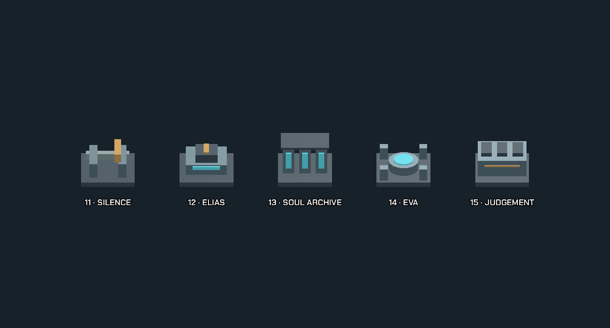
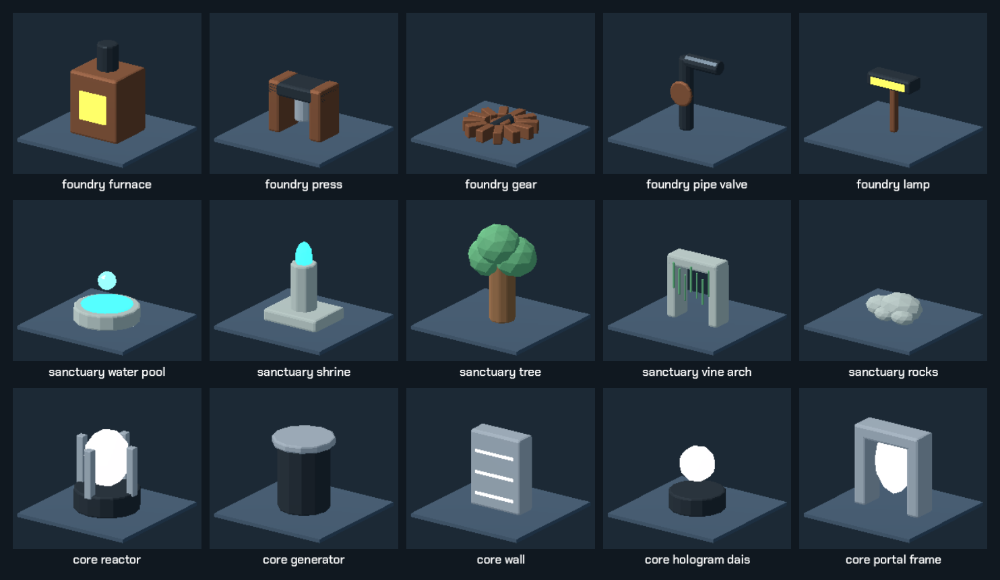
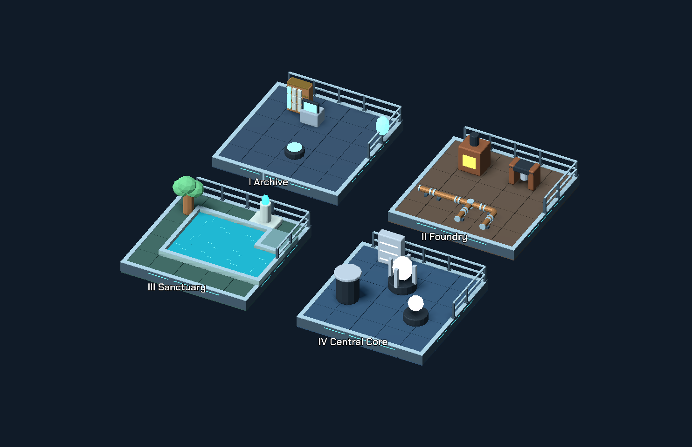

# Tài liệu — The Last Resonance

Refactor: [kế hoạch theo chức năng](plan/done/functional-refactor.md) · [kiến trúc sau refactor](REFACTOR_ARCHITECTURE.md). Kế hoạch đã hoàn tất nằm trong [plan/done/](plan/done/).

Godot 4.7 · 15 màn · 4 chương · tối ưu cảm ứng Android.

**Cập nhật trạng thái:** 2026-10-02.

**Đã xong:** campaign; save có phục hồi/migration; unlock tới ending; chấm sao và
phí gợi ý; refactor theo chức năng (RF-00 → RF-08); kit map; dressing; environment
dynamics; module animation; hoàn thiện Core/Foundry/landmark; ngoại cảnh sector;
ánh sáng dễ quan sát; nước chương 3; phản hồi map; nhạc theo chương; phòng thử
**Phòng Vọng Âm**; visual review desktop; APK debug qua preflight.

**Còn lại:** playtest máy Android thật (chạm, focus, cỡ màn, FPS, nhiệt, RAM và
thời gian tải). Bốn cluster prefab đã đạt kiểm tra hình học/metadata nhưng vẫn cần
visual camera review trước khi tái sử dụng trong campaign.



## Chiến dịch

| Ch | Màn | Khu | Dạy | Par hiện tại |
| --- | ---: | --- | --- | --- |
| I | 1–4 | Forgotten Archive | Đẩy Core → thứ tự → cửa | 12 / 28 / 34 / 53 |
| II | 5–8 | Mechanical Foundry | Siết cửa; L7 cầu; L8 tổng hợp | 57 / 73 / 75 / 87 |
| III | 9–12 | Flooded Sanctuary | Portal → Elevator → tổng hợp | 46 / 42 / 61 / 85 |
| IV | 13–15 | Central Core | Energy Node → nhịp EVA → phán quyết | 40 / 28 / 81 |

Hai tầng (thang một chiều): **L11, L12, L14**. Spec: [LEVEL_MAP_BLUEPRINT.md](LEVEL_MAP_BLUEPRINT.md) · [MULTI_FLOOR_LEVEL_GUIDE.md](MULTI_FLOOR_LEVEL_GUIDE.md).

## Kit hình

| Bộ | Số | Ảnh | Spec |
| --- | ---: | --- | --- |
| Chapter props + identity | 23 | [preview](CHAPTER_PROPS_PREVIEW.png) | [CHAPTER_MAP_PROPS.md](CHAPTER_MAP_PROPS.md) |
| Modular kit | 20 | [preview](MODULAR_KIT_PREVIEW.png) | [MODULAR_MAP_KIT.md](MODULAR_MAP_KIT.md) |
| Kit bổ sung (2026-10-01) | 13 | [preview](MAP_EXPANSION_GODOT_PREVIEW.png) | [MAP_KIT_EXPANSION.md](MAP_KIT_EXPANSION.md) |
| Cluster prefab editor | 4 | — | [MAP_CLUSTERS.md](MAP_CLUSTERS.md) |
| Narrative landmarks | 5 | trên | cùng [CHAPTER_MAP_PROPS](CHAPTER_MAP_PROPS.md) |

MeshLibrary: **91** item. Scenery không thêm collision; puzzle do `resources/levels/*.tres`.





## Runtime

| Chủ đề | File |
| --- | --- |
| Vật liệu / weathering theo chương | [CHAPTER_MATERIAL_PASS.md](CHAPTER_MATERIAL_PASS.md) |
| Animation Blender + FX module trong campaign | [MODULE_MOTION.md](MODULE_MOTION.md) |
| Sàn / tường theo chương trong 15 màn | [CAMPAIGN_SURFACES.md](CAMPAIGN_SURFACES.md) |
| Core, máy và landmark nâng cấp sau refactor | [ASSET_POLISH.md](ASSET_POLISH.md) |
| Model Blender cho cửa / cầu / thang gameplay | [AUTHORED_MECHANISMS.md](AUTHORED_MECHANISMS.md) |
| Ambience + SFX plate | [AUDIO_ENVIRONMENT_PASS.md](AUDIO_ENVIRONMENT_PASS.md) |
| Visual desktop (đã review 15 màn) | [VISUAL_POLISH_PASS.md](VISUAL_POLISH_PASS.md) |
| Render mobile (bỏ glow/sao/nhiều đèn) | [MOBILE_RENDER_PASS.md](MOBILE_RENDER_PASS.md) |
| Export APK | [ANDROID_EXPORT_PREFLIGHT.md](ANDROID_EXPORT_PREFLIGHT.md) |
| Kiểm kê file | [ASSET_INVENTORY.md](ASSET_INVENTORY.md) |

JSON bake (test đọc): `CHAPTER_IDENTITY_PROPS_BOUNDS.json`, `MODULAR_KIT_BOUNDS.json`, `MAP_CLUSTER_CATALOG.json`.

Save hiện dùng `src/core/progress_store.gd` để kiểm tra dữ liệu, phục hồi bản dự
phòng và migrate tiến độ cũ. `src/core/score_rules.gd` tách riêng ngưỡng 1–3 sao:
phí gợi ý không tăng bước thật hay thay par, nhưng được cộng vào `score_moves`.

## Kiểm tra

Checkpoint refactor 2026-10-02 trên Godot 4.7.2:

| Nhóm | Kết quả |
| --- | --- |
| Solver/par `validate_levels.py` | PASS — 15/15 màn giải được, par khớp route tối ưu |
| Godot `tools/run_tests.py` | PASS — **35/35** regression, gồm 4 lần chạy `asset_pilot_runtime` theo level |
| Placement `validate_map_decorations.py` | PASS — 930 decoration, 15 màn |
| Asset audit `audit_assets.py` | PASS — 329 file, không có literal reference bị thiếu |
| Android `validate_android_export.py` | Chưa chạy lại sau refactor; cần preflight + playtest thiết bị trước nộp |

Các lệnh cốt lõi:

Yêu cầu Python 3 và Godot 4.7.x có trong `PATH` dưới tên `godot` (`godot.exe`
trên Windows cũng được PowerShell tự nhận).

```powershell
python tools/validate_levels.py
python tools/run_tests.py
python tools/run_tests.py -g gameplay ui
python tools/validate_map_decorations.py
python tools/audit_assets.py
python tools/validate_android_export.py
```

Để chạy toàn bộ regression Godot, mỗi file `tests/verify*.gd` có `.tscn` cùng tên
được chạy bằng scene; các script `extends SceneTree` còn lại chạy với `-s`.

`tools/validate_asset_pilot.py` là validator của roster pilot ban đầu và hiện **không
phải release gate**: nó vẫn đòi ba prop đã được thay trong dressing mới ở L2/L6/L14.
Placement tổng thể hiện được khóa bằng `validate_map_decorations.py` cùng các verify
props, modular kit, material, dynamics và visual review. Chi tiết lịch sử:
[archive/ASSET_PILOT.md](archive/ASSET_PILOT.md).

Capture visual (cần cửa sổ, ghi `.codex_qa/visual_polish/`): `tests/asset_pilot_capture.tscn`, `tests/narrative_map_capture.tscn`.

Ngoại cảnh bốn chương: [SECTOR_EXTERIOR.md](SECTOR_EXTERIOR.md).

Sửa vật thể lấn/xuyên lối đi: [SCENERY_CLEARANCE.md](SCENERY_CLEARANCE.md).

Ánh sáng dễ quan sát: [LIGHTING_READABILITY.md](LIGHTING_READABILITY.md).

Nước chương 3: [SANCTUARY_WATER.md](SANCTUARY_WATER.md).

Phản hồi map và nhân vật: [MAP_RESPONSES.md](MAP_RESPONSES.md).

Bản thử van nước/ký ức/ngoại hình: [TIDAL_ECHO_TRIAL.md](TIDAL_ECHO_TRIAL.md).

Bộ model Blender, Mote và trạm phục hồi: [ECHO_BLENDER_EXPANSION.md](ECHO_BLENDER_EXPANSION.md).

Pass cũ: [archive/](archive/README.md).
