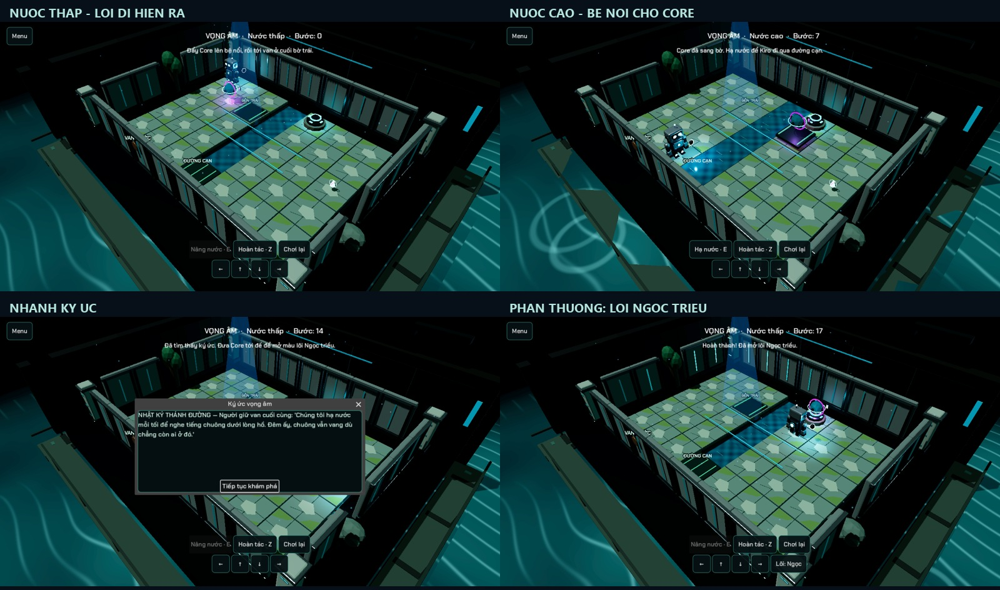

# Phòng vọng âm: bản thử nước

Mở từ menu chính → **PHÒNG VỌNG ÂM**. Đây là phòng phụ, không thêm vào thứ tự 15 màn chiến dịch. Dùng WASD/mũi tên hoặc nút trên màn hình, E điều khiển van khi đứng sát, Z hoàn tác. Nút Chơi lại khôi phục phòng; Menu quay về trang đầu.

Core phải được đẩy lên bệ ở bến trái. Nâng nước đưa bệ và Core sang bến phải, đồng thời ngập đường cạn. Hạ nước để Kiro qua đường cạn; lối này không chịu được Core nặng. Đưa Core tới đế ở bờ phải để giải phòng. Bản thử không dùng solver runtime hay đòi đồng tiền/vật phẩm tiêu hao.

Nhánh phụ có mảnh ký ức ở bờ phải. Thu ký ức và giải phòng mở màu lõi **Ngọc triều**: mắt/lõi và vòng nhận diện Kiro mang sắc xanh ngọc. Màu được tự trang bị lần đầu và áp dụng cả trong chiến dịch. Nút Lõi trong phòng đổi giữa Ngọc và nguyên bản. Thông tin mở khóa/trang bị lưu qua progress store hiện có, tương thích save cũ. Reset tiến độ xóa cả phần thưởng này.

Undo khôi phục player, Core, số bước, nước, bệ đã vận chuyển và ký ức của lượt chơi. Phần thưởng đã nhận là tiến độ lâu dài, không bị thu hồi khi undo/restart. Màn vẫn cho khám phá sau khi đưa Core vào đế để lấy ký ức còn thiếu. Chưa nhận thưởng nếu chỉ nhặt ký ức mà chưa giải phòng.

Tái sử dụng BoardView, GameLogic, lighting, camera, âm thanh và GLB hiện có. `TidalTrial` sở hữu luật nước và lịch sử riêng, không thêm luật đặc biệt vào campaign. `water_gap` chỉ bỏ sàn khô tại các ô kênh của bản thử. Logic/view/HUD chia thành các module độc lập. Không cần model mới từ Blender cho lần thử này.

QA: route `DRDDDRVVRRRRUULLU` (V là van) chạy thành công bằng logic và scene thật; high water khóa lối, Core đi bằng bệ, undo trả đúng toàn bộ lịch sử, save phần thưởng reload đúng và dữ liệu lỗi không ghi đè save tốt. Replay 15 màn, surfaces, HUD, map response, lighting, material và mobile budget đều PASS. Render Vulkan đã kiểm tra trạng thái thấp/cao, ký ức và phần thưởng. Không lưu thưởng hay thay tiến độ người chơi trong QA. Chưa playtest Android thật.

